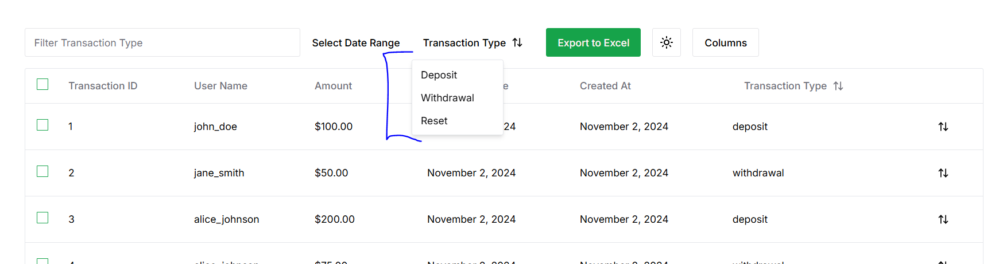
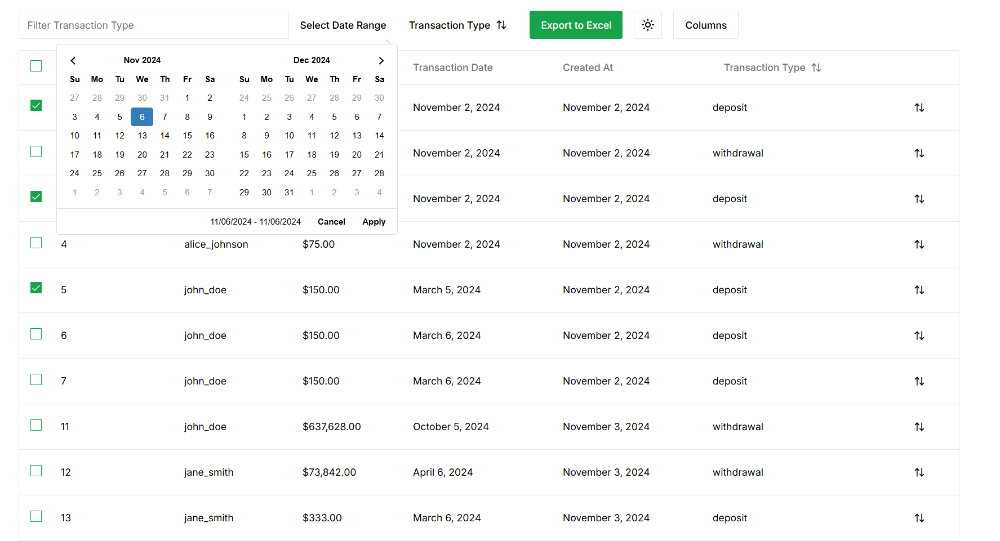
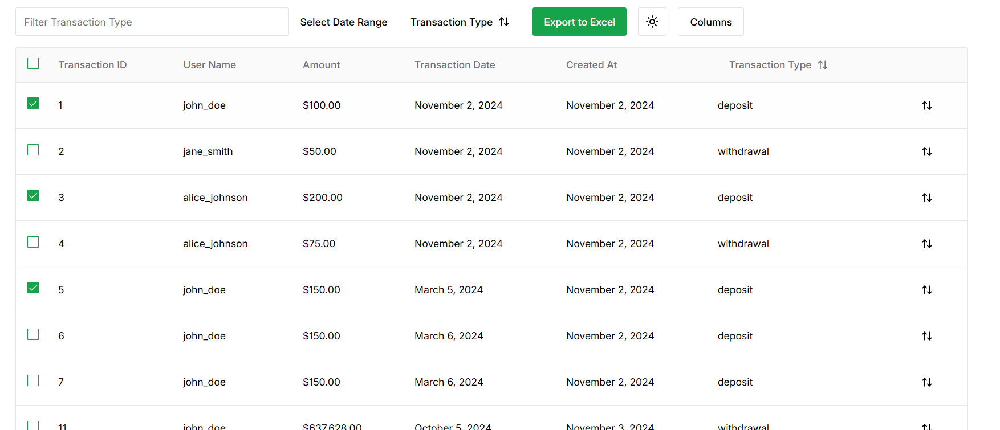

# User Manual for MyApp

## Table of Contents
1. [Introduction](#introduction)
2. [Installation](#installation)
3. [Getting Started](#getting-started)
4. [Features](#features)
5. [Usage](#usage)
6. [Troubleshooting](#troubleshooting)
7. [FAQs](#faqs)
8. [Support](#support)
9. [License](#license)

---

## Introduction
Welcome to Blue Project Transaction Filter. Designed to help users filter transaction my transactioType or by Date Range. Users are aslo alow to export filteried results in a .csv file for futher data manuplation  This manual will guide you through the installation process, usage instructions, and troubleshooting tips.

## Installation
### System Requirements
- **Operating System**: Windows 10 or later, macOS 10.13 or later, or any modern Linux distribution
- **Memory**: 4 GB RAM or more recommended
- **Disk Space**: 200 MB of free space

### Installation Steps
1. **Download**: Visit [blueProject.com/download](https://myapp.com/download) to download the latest version.
2. **Run the Installer**: Open the downloaded file and follow the on-screen instructions.
3. **Launch**: Once installed, open BluePrject from your Applications (macOS) or Start Menu (Windows).

## Getting Started
After installation, launch MyApp. You’ll be greeted by a welcome screen where you can:
- Create a new account
- Log in with existing credentials

Follow the setup wizard to configure your initial settings.

## Features
- **View Transaction**: View all transaction in tabular format.
- **Filter Transactions**: Display filtired transaction.
- **Download Transaction in CSV Format**: Click Dowload button to Export filtered transaction.

## Usage
### Filter Transactions by transactionType
1. Go to the **Transaction** tab.
2. Click Edit transaction Type.
2. Click "deposit" or "withdrawal".
3. Transaction will filter based on transactionType

### Filter by Date Range
1. Select the "Select Date Range Button"
2. Date picker will appare 
2. Select date range 
2. Click **Apply**.
3. Transaction within date range will be displayed

### Export CSV file
1. Select the "Export to Ecel button"
2. .csv file will be downloaded with filtered transaction 

## Troubleshooting
### Transaction feature wont Open
1. Ensure database is up and running.
2. Ensure back end is up and running and running on port 8080

### Forgotten Password
1. On the login screen, click **Forgot Password**.
2. Enter your registered email to receive a password reset link.

## FAQs
**Q: Can I use Blue {roject} offline?**  
A: Yes, blueproject has limited offline functionality. You can create and edit tasks, which will sync when you're back online.

**Q: How do I export my tasks?**  
A: Go to **Settings > Export** and choose your preferred file format (CSV, PDF).

## Support
If you need help, contact our support team:
- **Email**: support@myapp.com
- **Phone**: +1-800-555-0123
- **Website**: [myapp.com/support](https://myapp.com/support)

## License
This software is licensed under the MIT License. See the [LICENSE](LICENSE.md) file for more details.
